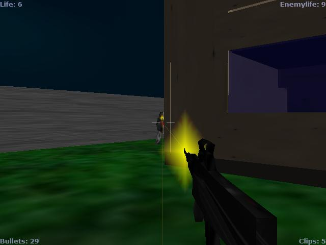



## A Full 3D game \(Single Player Counter\-Strike Clone\)

### Description

This is a Little 3D game where you have to shoot your opponent (The Computer) 10 times, before he shoots you 10 times. The Enemy Runs around using Way Points, and will shoot you as soon as he sees you. This Program Is written around DirectX 8.1 and includes stuff like animations, lighting, Blending, collision detection, mesh loading and other strange stuff.

The Current Settings are in 320x240 but you can change these by altering the SWidth and SHeight constants. (located in the DirectXEngine.bas).

Many things were kinda copied from HL:CS (sounds, level design). There is currently a tiny problem with the Speed (It's 

----

slow), but i hope this is no real problem :). Have fun, and i hope this helped in any way...

--- www.SturmNacht.de.vu
 
### More Info
 

             |
---                |---
**Submitted On**   |2003-08-07 18:08:48
**By**             |[\<\<ULTIMA\>\>](https://github.com/Planet-Source-Code/PSCIndex/blob/master/ByAuthor/ultima.md)
**Level**          |Advanced
**User Rating**    |4.9 (200 globes from 41 users)
**Compatibility**  |VB 6\.0
**Category**       |[DirectX](https://github.com/Planet-Source-Code/PSCIndex/blob/master/ByCategory/directx__1-44.md)
**World**          |[Visual Basic](https://github.com/Planet-Source-Code/PSCIndex/blob/master/ByWorld/visual-basic.md)
**Archive File**   |[A\_Little\_3162541872003\.zip](https://github.com/Planet-Source-Code/ultima-a-full-3d-game-single-player-counter-strike-clone__1-47484/archive/master.zip)

